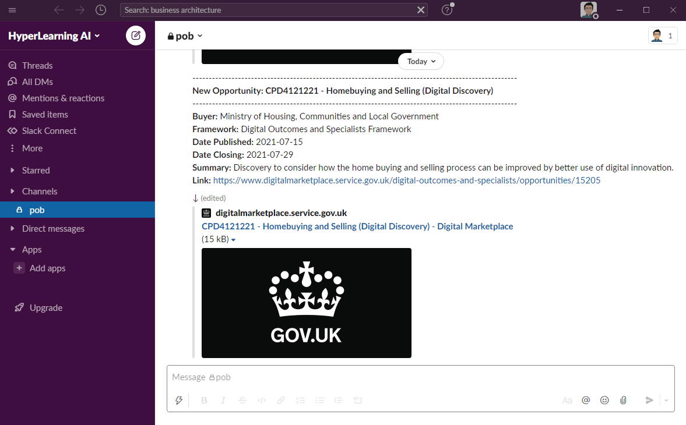

<br/>
<p align="center">
  <a href="https://docs.pob.directory" target="_blank">
    
  </a>
  <p align="center">
    Public Opportunities Bot (POB) is an open-source and easily extensible software project that fully-automates the collation, analysis and notification of procurement opportunities from public sector procurement frameworks in order to support business development.
    <br/>
    <br/>
    <a href="https://pob.directory" target="_blank"">Website</a> · <a href="https://docs.pob.directory" target="_blank"">Documentation</a>
  </p>
</p>
<br/>

||
|:---:|
|Automated notification of procurement opportunities in Slack|
<br/>

## Table of Contents  
[1. Introduction](#introduction)<br/>
&nbsp;&nbsp;&nbsp;&nbsp;[1.1. Vision](#vision)<br/>
&nbsp;&nbsp;&nbsp;&nbsp;[1.2. Benefits](#benefits)<br/>
&nbsp;&nbsp;&nbsp;&nbsp;[1.3. Open Frameworks](#frameworks)<br/>
[2. Getting Started](#getting-started)<br/>
&nbsp;&nbsp;&nbsp;&nbsp;[2.1. Build from Source](#build)<br/>
&nbsp;&nbsp;&nbsp;&nbsp;[2.2. Deployment](#deployment)<br/>
[3. License](#license)<br/>
[4. Acknowledgements](#acknowledgements)<br/>
[5. Contact and Further Information](#contact)<br/>
<br/>

## <a name="introduction"></a>1. Introduction

Public Opportunities Bot (POB) is an open-source and easily extensible software project that fully-automates the collation, analysis and notification of procurement opportunities from public sector procurement frameworks in order to support business development.
<br/>

### <a name="vision"></a>1.1. Vision

The ultimate aim of the Public Opportunities Bot (POB) is to provide a single platform for all global public sector procurement opportunities, supporting intuitive search, analytics and real-time notifications to any downstream business development, sales or collaboration system. Please refer to our [Roadmap](https://docs.pob.directory/introduction/roadmap) for further information regarding current and future features. POB was built and is actively maintained by [HyperLearning AI](https://hyperlearning.ai/).
<br/>

### <a name="benefits"></a>1.2. Benefits

The majority of existing public sector procurement frameworks require business development teams to sign up for e-mail based notifications when new procurement opportunities are published to their platforms. As most organisations sign up with a single e-mail address, e-mail notifications must either be forwarded to relevant individuals or a mailbox must be created. In either event, it creates a single point of failure and significantly limits effective business development collaboration across an organisation.
<br/><br/>
By using POB, organisations can utilise existing internal instant messaging and collaboration platforms (such as Slack, Microsoft Teams or Google Chat) to improve business development processes by automatically notifying and encouraging collaboration between teams and individuals across their organisation, from senior leadership and sales teams to project managers, software engineers and client-facing teams, as procurement opportunities are published in real-time.
<br/><br/>
Furthermore by integrating POB with existing internal business intelligence and data analysis systems (such as Microsoft Power BI, Tableau, Kibana or Salesforce) via native connectors, dedicated business development and sales teams can proactively monitor and analyse historic market trends, as well as predicting future demand and growth areas. 
<br/>

### <a name="frameworks"></a>1.3. Open Frameworks

POB is written in [Java 11](https://jdk.java.net/java-se-ri/11) and utilizes the following core open-source software frameworks and services:

* [OpenJDK 11](https://openjdk.java.net/projects/jdk/11/)
* [Spring Framework](https://spring.io/), including the following Spring projects:
  - [Spring Boot](https://spring.io/projects/spring-boot)
  - [Spring Data](https://spring.io/projects/spring-data)
  - [Spring Cloud](https://spring.io/projects/spring-cloud)
    - [Spring Cloud Function](https://spring.io/projects/spring-cloud-function)
    - [Spring Cloud Vault](https://spring.io/projects/spring-cloud-vault)
    - [Spring Cloud AWS](https://spring.io/projects/spring-cloud-aws)
    - [Spring Cloud Azure](https://spring.io/projects/spring-cloud-azure)
    - [Spring Cloud GCP](https://spring.io/projects/spring-cloud-gcp)
  - [Spring Security](https://spring.io/projects/spring-security)
  - [Spring Vault](https://spring.io/projects/spring-vault)
* [Apache Maven](https://maven.apache.org/)
* [Apache Commons](https://commons.apache.org/)
* [Elasticsearch](https://www.elastic.co/elasticsearch/)
* [HashiCorp Vault](https://www.vaultproject.io/)
* [Google Guava](https://github.com/google/guava)
* [Git](https://git-scm.com/)
<br/>

## <a name="getting-started"></a>2. Getting Started

The following instructions describe how to clone the POB source code repository into your development or deployment environment, and then how to compile, build and package the respective POB software services and applications ready for deployment.

### <a name="build"></a>2.1. Build from Source

#### Build Tools

Please ensure that the following prerequisite build tools are installed in your development or deployment environment.

* **[OpenJDK 11](https://openjdk.java.net/projects/jdk/11/)** - open source reference implementation of Java 11.
* **[Apache Maven](https://maven.apache.org/)** - open source build automation tool for Java.
* **[Git](https://git-scm.com/)** - open source distributed version control system.

#### Clone the Source Code

The open-source source code for the POB project may be found on GitHub at https://github.com/hyperlearningai/pob. To clone the POB source code repository into your development or deployment environment, please run the following Git command via your command line (or via your preferred Git GUI tool). The location of the cloned POB source code project folder will hereafter be referred to as `$POB_BASE`.

```
# Clone the POB GitHub public repository
$ git clone https://github.com/hyperlearningai/pob.git

# Navigate into the POB project folder
# This location will hereafter be referred to as $POB_BASE
$ cd pob
```

#### Maven Profiles

##### Parent Profiles

The following table describes the Maven profiles defined in `$POB_BASE/pom.xml`.

Profile Name | Default | Description
:--- | :--- | --- 
`apps` | Yes | Manages the lifecycle of all of POB's core services as well as all POB Spring Boot applications across all cloud vendors.

##### Application Profiles

The following table describes the Maven profiles defined in `$POB_BASE/pob-apps/pom.xml`.

Profile Name | Default | Description
:--- | :--- | --- 
`apps-multicloud` | Yes | Manages the lifecycle of all POB Spring Boot applications (i.e. serverless function apps and API applications) across all cloud vendors.
`apps-spring` | No | Manages the lifecycle of Spring Boot applications designed for development and testing purposes, or for deployment to self-managed or Spring Cloud environments.
`apps-aws` | No | Manages the lifecycle of AWS Spring Boot applications designed for deployment to AWS Lambda and AWS Beanstalk apps respectively.
`apps-azure` | No | Manages the lifecycle of Microsoft Azure Spring Boot applications designed for deployment to Azure Function apps and Azure Web Apps respectively.

#### Compile and Build

Please ensure that you have entered the correct configuration into the Spring bootstrap and application property files respectively, appropriate to your target deployment environment, prior to packaging POB. For further information regarding configuring POB, please refer to the POB [Bootstrap Configuration](https://docs.pob.directory/deployment-guides/configuration/bootstrap-configuration) and [Application Configuration](https://docs.pob.directory/deployment-guides/configuration/application-configuration) documentation pages respectively. To compile and build POB services and applications from source, please run the following commands via your command line.

```
# Navigate to $POB_BASE
$ cd $POB_BASE

# Clean the project working directory
$ mvn clean

# Compile, build and package POB
# By default this will build all services and applications
$ mvn package

# If you wish to build POB's core services only, 
# then disable the "apps" Maven profile as follows.
$ mvn package -P \!apps

# If you wish to build POB's core services but only the
# apps intended for deployment to a self-managed environment
# or to Spring Cloud, then enable the "apps-spring" Maven 
# profile as follows.
$ mvn package -P apps-spring

# If you wish to build POB's core services but only the
# apps intended for deployment to AWS, then enable the 
# "apps-aws" Maven profile as follows.
$ mvn package -P apps-aws

# If you wish to build POB's core services but only the
# apps intended for deployment to Azure, then enable the 
# "apps-azure" Maven profile as follows.
$ mvn package -P apps-azure
```

If you are running `mvn package` for the first time, it will take approximately 3 - 5 minutes to complete the build (dependent on the speed of your internet connection) as Maven will download all the required Java dependencies for the first time. Subsequent executions of mvn package should take between 1 - 2 minutes to complete.

### <a name="deployment"></a>2.2. Deployment

Assuming that `mvn package` completes successfully, you are now ready to deploy POB. Please follow the links below for deployment instructions specific to your target deployment environment.<br/>

* **[Self Managed](https://docs.pob.directory/deployment-guides/self-managed)** - deploy POB to a self-managed on-premise, public/private cloud or hybrid environment, integrated with entirely open-source self-managed software services including HashiCorp Vault and HSQLDB.<br/><br/>
* **[Amazon Web Services](https://docs.pob.directory/deployment-guides/amazon-web-services)** - deploy POB to the Amazon Web Services (AWS) cloud computing platform, integrated with AWS managed services including AWS Secrets Manager, Amazon S3, Amazon RDS and AWS Lambda.<br/><br/>
* **[Microsoft Azure](https://docs.pob.directory/deployment-guides/microsoft-azure)** - deploy POB to the Microsoft Azure cloud computing platform, integrated with Azure managed services including Azure Key Vault and Azure Functions.
<br/>

## <a name="license"></a>3. License

POB is an open-source software project available under the [MIT License](https://choosealicense.com/licenses/mit/).
<br/><br/>

## <a name="acknowledgements"></a>4. Acknowledgements

Provided below is the list of organisations and individuals who sponsor, and contribute towards, the development of the POB open-source project.

### Organisations

* **[HyperLearning AI](https://hyperlearning.ai/)** - Project sponsorship, management and maintenance

### Individuals

* **[Jillur Quddus](https://hyperlearning.ai/team/jillurquddus)** - Project Lead and Lead Java Engineer
<br/>

## <a name="contact"></a>5. Contact and Further Information

For further information, please visit the POB documentation website at https://docs.pob.directory or contact HyperLearning AI using the details below.

* **[Jillur Quddus](https://hyperlearning.ai/team/jillurquddus)**<br/>Chief Data Scientist and Principal Polyglot Software Engineer<br/>pob@hyperlearning.ai
